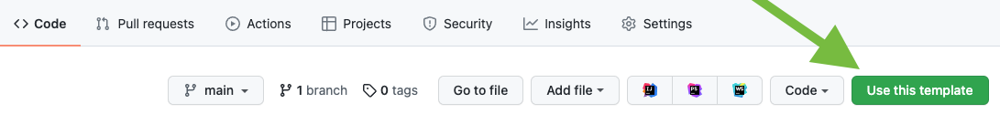

# SpaceInvaders2022

## Purpose
This partially configured Godot project will be used to demonstrate the implementation of the Software Development Course.

## Task

The scripts are at their initial state. As you progress through the course, you will be updating the scripts to complete the required functionality.

# How to start

Make you're logged into GitHub under your account. 

Click the Green "Use this template" button. This will copy the entire website and make your own version of the repository.

