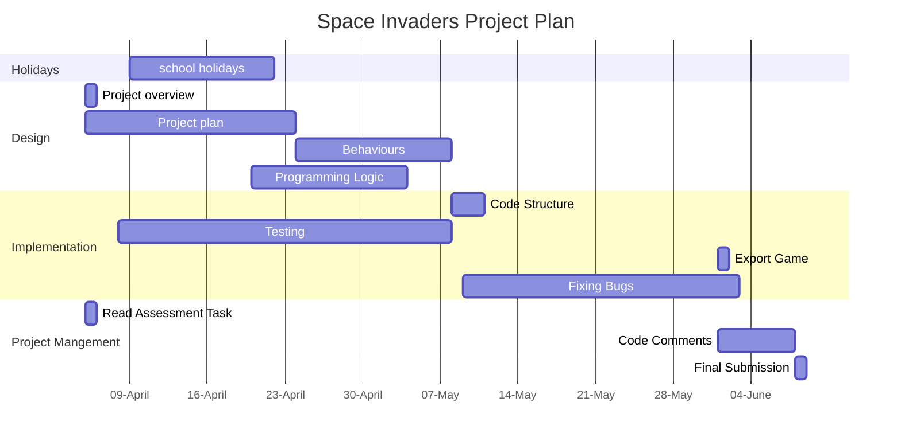

 # Project Overview
the game i made is a copy of space invaders where a ship shoots the enemys down and get points from doing so the player gets points per enemy he kils 

## future add ons 
later on i will add differnt and harder enemys to beat for more points 

# Behaviour - User Jorney 
 

# Planning Diagram - Project Plan 

